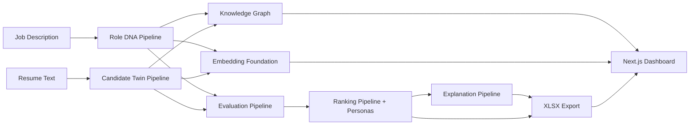

# TalentGraph AI

Explainable Hiring Intelligence Platform.

TalentGraph AI is a v1.0 hackathon-ready hiring intelligence demo. It evaluates candidates through structured role understanding, deterministic candidate profiles, semantic foundations, evaluator modules, hiring personas, explanations, counterfactual improvements, and XLSX export.

## Implemented Modules

1. **Role DNA Generator**: converts a job description into structured role requirements, skills, work signals, and reasoning.
2. **Candidate Digital Twin Builder**: converts resume text into normalized candidate profiles, metrics, skills, projects, and timeline.
3. **Knowledge Graph + Embedding Foundation**: builds graph snapshots and deterministic local embedding summaries for inspection.
4. **Candidate Evaluation Engine**: scores candidate-role fit across technical, growth, domain, and culture dimensions.
5. **Ranking Engine + Hiring Personas**: ranks evaluated candidates for Startup Founder, Enterprise Recruiter, and Research Team personas.
6. **Explainability + Counterfactuals**: explains strengths, risks, reasoning, and actionable score-gap improvements.
7. **Dashboard + XLSX Export + Demo Dataset**: provides a polished workflow UI, demo dataset, and ranking export workbook.

## Architecture



Backend pattern:

```text
API Router -> Pipeline -> Service -> Provider/Repository -> Domain Model
```

The working demo uses deterministic local providers and in-memory repositories. PostgreSQL, Neo4j, ChromaDB, OpenAI, and sentence-transformer integrations are intentionally not active in v1.0.

## Module Flow

```text
1. Generate Role DNA
2. Generate Candidate Twins
3. Build Knowledge Graph and Embedding Foundation
4. Evaluate Candidates
5. Rank Candidates by Hiring Persona
6. View Explanations and Counterfactuals
7. Export Rankings to XLSX
```

## API Endpoints

System:

```text
GET  /health
```

Role DNA:

```text
POST /api/v1/upload-job
POST /api/v1/generate-role-dna
GET  /api/v1/role-dna
GET  /api/v1/role-dna/{role_id}
```

Candidates:

```text
POST /api/v1/upload-candidates
POST /api/v1/build-digital-twins
GET  /api/v1/candidates
GET  /api/v1/candidate/{candidate_id}
```

Graph and embeddings:

```text
POST /api/v1/build-graph
GET  /api/v1/graph/{graph_id}
POST /api/v1/generate-embeddings
GET  /api/v1/embeddings/{collection_id}
```

Evaluation, ranking, explanations, and export:

```text
POST /api/v1/evaluate
GET  /api/v1/evaluations/{evaluation_id}
POST /api/v1/rank
GET  /api/v1/rankings/{role_id}
POST /api/v1/generate-explanations
GET  /api/v1/explanations/{candidate_id}
POST /api/v1/export-rankings
```

Legacy placeholders returning `501`:

```text
POST /api/v1/rank-candidates
GET  /api/v1/rankings
```

## Setup

Backend:

```powershell
python -m venv .venv
.venv\Scripts\Activate.ps1
python -m pip install -r requirements/dev.txt
python -m pip install -e apps/api
uvicorn app.main:app --app-dir apps/api --host 0.0.0.0 --port 8000 --reload
```

Frontend:

```powershell
npm.cmd install
npm.cmd --workspace apps/web run dev
```

URLs:

```text
Frontend: http://localhost:3000
Backend:  http://localhost:8000
API docs: http://localhost:8000/docs
```

Docker:

```powershell
docker compose up --build
```

## Demo Dataset

Use `data/demo/`:

```text
data/demo/job-description.md
data/demo/resumes/01-mira-shah.md
data/demo/resumes/02-aarav-menon.md
data/demo/resumes/03-kavya-rao.md
data/demo/resumes/04-rahul-iyer.md
```

## Verification

Backend:

```powershell
python -m pytest apps/api/tests
```

Frontend:

```powershell
npm.cmd --workspace apps/web run build
```

Current release-candidate baseline:

```text
Backend: 53 passed, 1 warning
Frontend: production build passing
End-to-end demo dataset: verified
XLSX export: verified
```

## Screenshots

Recommended submission screenshots:

- Workflow dashboard with all five main steps visible.
- Role DNA radar chart and role metrics.
- Candidate Twin timeline and metric cards.
- Evaluation score cards.
- Ranking leaderboard with persona selector.
- Explanation panel with strengths, risks, and counterfactual cards.
- XLSX export opened in Excel or spreadsheet viewer.

## Repository Layout

```text
apps/
  api/             FastAPI backend
  web/             Next.js frontend dashboard
packages/
  shared/          Shared TypeScript contracts
data/
  demo/            Release demo dataset
  jobs/            Additional job descriptions
  resumes/         Additional resume samples
  ontology/        Skill/domain/technology ontology seeds
docs/              Handoff, release, and demo documentation
infra/
  docker/          API and web Dockerfiles
requirements/      Python dependency groups
```

## Known Limitations

- Persistence is process-local and in-memory.
- PostgreSQL, Neo4j, and Chroma repositories are skeleton boundaries only.
- No real OpenAI calls or sentence-transformer model execution.
- No authentication, recruiter chat, notifications, or autonomous agents.
- No Hire/No Hire recommendation labels.
